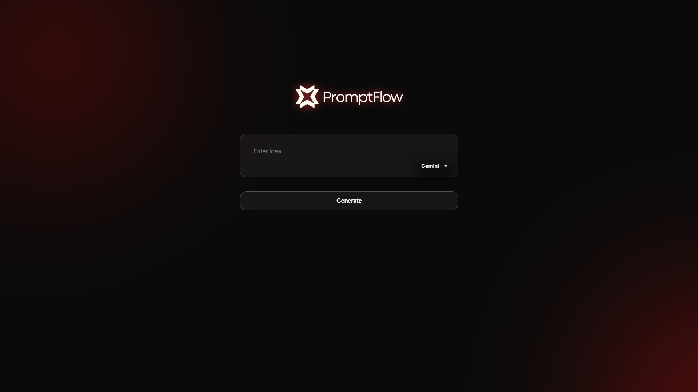
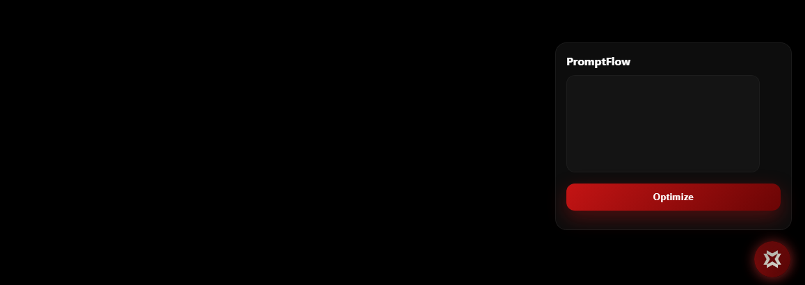

PromptFlow ⚡
Platform-Aware AI Prompt Optimization

============================================================

🚀 OVERVIEW

PromptFlow is a platform-aware AI prompt optimizer built to turn rough ideas into clear, structured, and high-performing prompts—tailored precisely for how different AI platforms and models interpret instructions.

Instead of relying on trial-and-error prompting, PromptFlow adapts tone, structure, and intent so each prompt feels native to its target platform.

The result:
• Better reasoning
• Clearer outputs
• Higher-quality generations
• Zero manual rework

============================================================

🌐 LIVE APPLICATION

🔗 Live Tool:
https://promptflow-co.netlify.app/

No setup required. Open the link and start generating optimized prompts instantly.

============================================================

🧩 CHROME EXTENSION (NEW)

PromptFlow is now available as a lightweight Chrome Extension for ultra-fast workflows.

How it works:
1️⃣ Highlight any text on a webpage  
2️⃣ Click the PromptFlow icon (bottom-right)  
3️⃣ The text is automatically captured  
4️⃣ Click Optimize  
5️⃣ Receive a refined, platform-ready prompt instantly

No copy-paste. No context switching. Just flow ⚡

============================================================

🎯 SUPPORTED PLATFORMS

+----------------------+----------------------------------------------+
| Platform | Optimization Style |
+----------------------+----------------------------------------------+
| ChatGPT | Clear structure & logical reasoning |
| Gemini | Context-rich, analytical framing |
| Claude | Detailed, task-oriented precision |
| Midjourney | Artistic direction & visual guidance |
| Stable Diffusion | Keyword-dense visual descriptors |
| DALL·E | Direct, intent-focused prompting |
| Adobe Firefly | Stylized creative optimization |
| Hugging Face Models | Transformer-friendly prompt structure |
+----------------------+----------------------------------------------+

============================================================

✨ KEY FEATURES

✔ Platform-aware prompt engineering  
✔ One-click optimization via Chrome Extension  
✔ Supports content, coding, research, analysis & image prompts  
✔ Minimal, premium UI with focused UX  
✔ Powered by Hugging Face Inference API  
✔ Fully hosted (Netlify + Render)

============================================================

🛠 TECH STACK

+------------+----------------------------------+
| Layer | Technology |
+------------+----------------------------------+
| Frontend | HTML, CSS, JavaScript |
| Backend | Python, Flask |
| AI Engine | Hugging Face Inference API |
| Hosting | Netlify (Frontend), Render |
| Extension | Chrome Extension (Manifest V3) |
+------------+----------------------------------+

============================================================

⚙ OPTIONAL LOCAL SETUP

Most users do not need to run PromptFlow locally.

Local setup is only recommended if you want to extend or customize the project.

Requirements:
• Python 3.9+
• Hugging Face API Key

High-level steps:
Clone repository → Install dependencies → Configure environment variables → Run Flask server → Load extension in Chrome

============================================================

🧠 CUSTOMIZATION

Platform behavior can be tuned directly in the backend logic.

You can adjust:
• Prompt tone  
• Verbosity  
• Structure  
• Creativity level  
• Instruction strictness

No frontend changes required.

============================================================

🏁 FINAL NOTE

PromptFlow is built to remove prompt guesswork.

Clean input.  
Correct structure.  
Platform-native output.

If you find this project useful, consider starring the repository ⭐  
It helps the project grow and supports future improvements.
